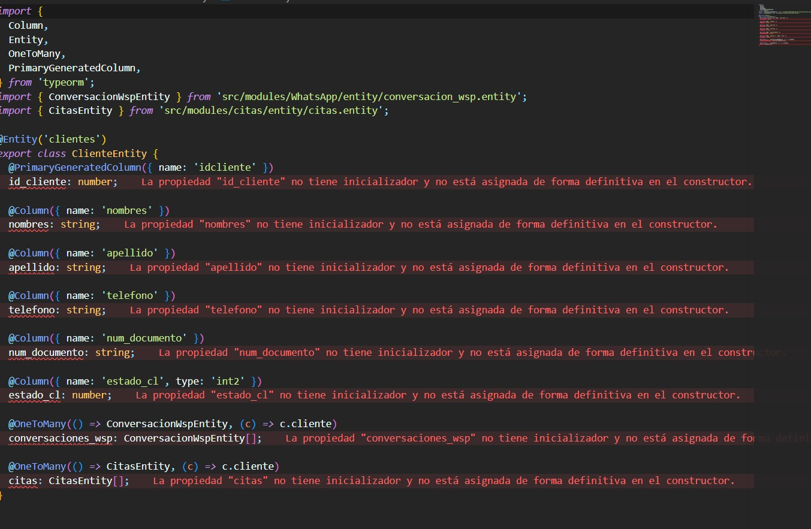
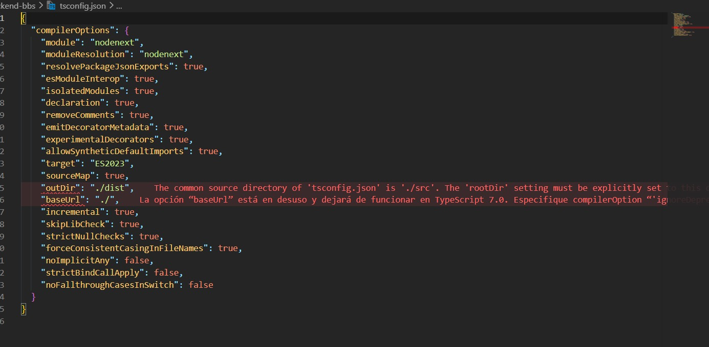
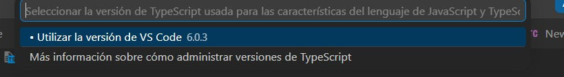

# Instructivo — Resolución de problemas comunes

## Problemas de versiones de TypeScript (VS Code / Cursor)

### ¿Qué pasa?

A veces el **editor** muestra errores en rojo (entidades TypeORM, `tsconfig.json`, etc.) pero el proyecto **sí compila** con `npm run build` o `npm run start:dev`.

Eso suele ocurrir porque hay **dos TypeScript distintos**:

| Origen | Para qué sirve |
|--------|----------------|
| **TypeScript del IDE** (ej. VS Code 6.0.3) | Subraya errores, autocompletado |
| **TypeScript del proyecto** (`node_modules/typescript`) | `npm run build`, `npx tsc`, Nest |

Tener la misma versión en terminal (`npx tsc -v`) **no garantiza** que el IDE use la misma.

---

### Síntomas habituales

Estos errores **no siempre significan que el código esté mal**. Muchas veces el IDE analiza con una versión de TypeScript distinta a la del proyecto.

#### Ejemplo 1 — Entidades TypeORM en rojo

Mensaje típico: *«La propiedad `id_cliente` no tiene inicializador y no está asignada de forma definitiva en el constructor»*.

Ocurre en clases como `ClienteEntity` porque TypeORM llena esas propiedades en runtime, pero el analizador del IDE las trata como campos normales de TypeScript.



**Qué revisar:** si `npm run build` compila bien, el problema es casi seguro del **IDE**, no de la entidad.

---

#### Ejemplo 2 — Avisos en `tsconfig.json`

Advertencias sobre `rootDir`, `baseUrl` en desuso, etc. Dependen de la versión de TypeScript que use el **editor**, no solo la de terminal.



**Qué revisar:** comparar `npx tsc -v` con la versión que muestra el selector del IDE (paso 1 siguiente).

---

### Proceso de solución (seguir en orden)

#### Paso 1 — Confirmar qué TypeScript usa el IDE

1. Abrir la **raíz del proyecto** (`backend-bbs`), no una subcarpeta.
2. `Ctrl + Shift + P` → **TypeScript: Select TypeScript Version**  
   (en español: *Seleccionar la versión de TypeScript usada para las características del lenguaje…*).
3. **Problema detectado:** si solo aparece **«Utilizar la versión de VS Code 6.0.3»** (u otra del editor) y **no** aparece **«Use Workspace Version»**, el IDE **no** está usando el TypeScript del proyecto.



**Objetivo:** después del paso 3, debe quedar seleccionado **Use Workspace Version** → `node_modules/typescript/lib`.

#### Paso 2 — Instalar dependencias del proyecto

En la raíz del repo:

```bash
npm ci
```

> Usar **`npm ci`**, no `npm install`, para respetar exactamente el `package-lock.json`.

Comprobar que existe TypeScript local:

```bash
npx tsc -v
```

Debe mostrar la versión instalada en `node_modules` (la del lockfile del repo).

#### Paso 3 — Forzar TypeScript del workspace en el IDE

Repetir **Paso 1** y elegir:

**Use Workspace Version** → `node_modules/typescript/lib`

Si la opción no aparece:

- Verificar que corriste `npm ci` sin errores.
- Verificar que existe la carpeta `node_modules/typescript`.
- Cerrar y volver a abrir el IDE con la carpeta `backend-bbs` como raíz.

#### Paso 4 — (Opcional) Fijar la configuración para todo el equipo

Crear `.vscode/settings.json` en el repo:

```json
{
  "typescript.tsdk": "node_modules/typescript/lib",
  "typescript.enablePromptUseWorkspaceTsdk": true
}
```

Commitear ese archivo para que todos usen la misma versión al abrir el proyecto.

#### Paso 5 — Verificar que el código compila

```bash
npm run build
```

| Resultado | Significado |
|-----------|-------------|
| **Build OK** y el IDE sigue en rojo | Problema del **editor**; repetir pasos 3 y 4. |
| **Build falla** | Problema real de compilación; revisar `tsconfig.json` y dependencias. |

---

### Checklist rápido para el equipo

```bash
git pull
npm ci
npx tsc -v
npm run build
```

En el IDE: **TypeScript: Select TypeScript Version** → **Use Workspace Version**.

---

### Notas

- **Docker** unifica Postgres y el runtime en contenedor; **no** cambia qué TypeScript usa el IDE. Para eso hace falta el workspace TS (pasos anteriores).
- No commitear cambios locales en `tsconfig.json` sin acordarlo con el equipo.
- Siempre commitear `package-lock.json` junto con `package.json`.
- Las capturas del instructivo están en `public/`. **Deben subirse a Git** para verse en GitHub:

```bash
git add public/ README.md
git commit -m "docs: instructivo TypeScript con imágenes"
git push
```

---

## Base de datos con Docker

### Levantar Postgres

```bash
npm run db:up
```

Credenciales por defecto (ver `docker-compose.yml`):

- Usuario: `postgres`
- Contraseña: `postgres`
- Base: `bbs`
- Puerto host: `5432`

### Entrar a la base desde la terminal

```bash
docker exec -it backend-bbs-db psql -U postgres -d bbs
```

Desde el host (si tienes `psql` instalado):

```bash
psql -h 127.0.0.1 -p 5432 -U postgres -d bbs
```

### Semilla de datos

```bash
npm run seed
```

Sin vaciar tablas antes:

```bash
npm run seed:keep
```

### Vaciar tablas de desarrollo

```bash
npm run db:reset
```

---

## Arrancar la API

```bash
npm run start:dev
```

La API queda en `http://localhost:4000` (prefijo global `/api`).
